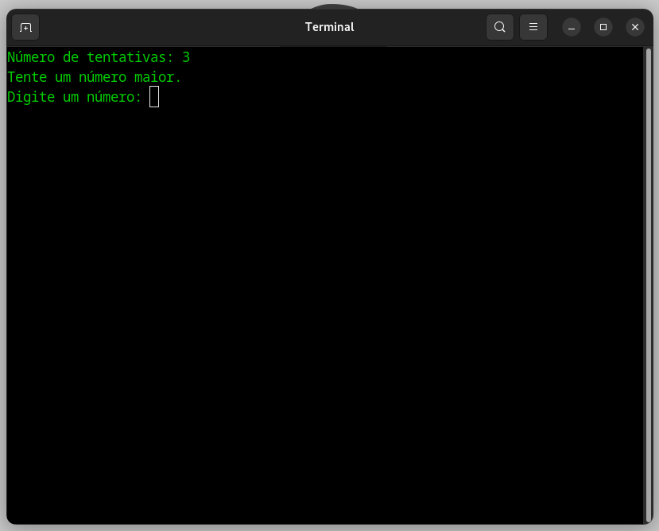

# dio-cpp-minigame
Repositório criado para submissão de desafio de código "Desenvolva um Game com suporte do ChatGPT".

## O minigame:
* A funcionalidade é simples, consiste em apenas o usuário tentar descobrir um número gerado aleatóriamente pelo computador em até 5 tentativas.
* O software analisa as respostas e diz se o usuário chutou um número muito alto ou muito baixo, para ajudar na descoberta do número secreto.

Intruções para execução: Vá até a pasta Debug, e execute o arquivo "minigame-dio", via Terminal.
(Testado para Linux)

### Imagens do funcionamento:

